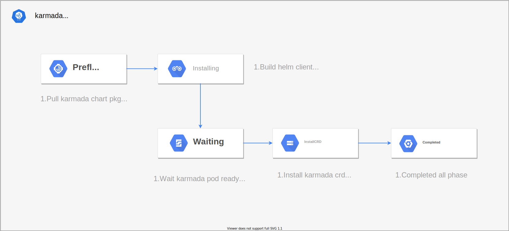

## 背景
在众多云平台中使用 karmada 作为多云分发的引擎。不同的用户可能需要不同的 karmada 实例来纳管自己的集群。或者用户需要将不同功能的集群进行分组管理，那么需要安装更多 karmada 实例来纳管集群。如果用户集群数量减少，并不需要更多 karmada 实例的情况下，又需要移除 karmada 实例。虽然社区为我们提供 `chart` 和 `karmadactl` 等多种方式来安装，删除 karmada 和接入 member 集群等功能。但是对于云平台来说，并不能以 API 的方式来管理 karmada 的生命周期。

### 目标
在多云平台中可以使用 API 的形式来创建，删除 karmada 集群，并可以接入 member 集群。只需要提供远端集群的认证方式，就可以将整个 karmada 所有的组件运行起来，并将访问 karmada 实例的认证信息返回，在平台中就可以访问 karmada 实例。并能知道 karmada 实例的健康状态。

### 非目标
支持 karmada 的 helm 和 karmadactl 的远端安装模式，不支持需要 ssh 到主机进行安装的模式。

## 提案
我们将提供一个 crd 和 operator 来完成 karmada 实例的安装。在 crd 中定义安装的信息，安装集群的访问证书，可以是证书和 token，甚至仅提供 kubeconfig 信息，并不需要 ssh 到远端主机。operator 将完成整个安装流程，并将安装的阶段信息和结果信息反馈到 cr 资源中。用户通过这个 cr 就能掌握整个 karmada 集群的信息。我们将使用 helm 的安装方式快速实现安装过程，后期将支持更多的安装方式，例如 `karmadactl` 等，也可以提供接入 member 集群的需求。

### 用户使用场景

#### 场景1: 
在多平台中，用户A 管理多个不同的 k8s 集群。现在想把不同的集群用不同的 karmada 实例进行管理，用户需要按照自己的需求再添加一个或者多个 karmada 实例。并把不同的集群接入到不同的 karmada 实例中。

#### 场景2:
对于平台管理员，需要进对多个 karmada 实例进行管理。在管理平台只需要创建一个 cr 就可以自动安装一个 karmada 的实例。并能清晰的知道一共有多少个 karmada 实例和每一个 karmada 实例的健康状态。

## 实现细节

### 架构图


### 安装阶段

在创建一个 `karmadaDeployment` 的 cr，operator 将完成一下流程：
* Preflight：安装前的准备工作，下载 karmada chart 包，检查集群的认证信息是否可用并创建 helmClient，有两种方式来提供连接安装集群的认证信息。
  1. kubeconfig: 直接将安装集群的 kubeconfig 进行挂载到 pod 里面去。
  2. secret: 提供连接集群所需要的 `ca` 和 `token`。

* Intalling：安装阶段，将从 cr 中构建 chart 的 value 信息，设置 registry，和 k8s registry 信息。并设置 karmada 所有组件的安装信息（image，replicas等）。使用 helm v3 的 client 创建 chart release。client 成功返回进入下一个阶段。

* Waiting：等待整个 karmada 所有 pod 都启动成功，watch karmada 所有安装组件的 deployment pod 启动数量，组件至少有一个 pod 启动，就认为组件已经成功安装。验证 karmada-apiserver 健康状态，初始化 karmada-apiserver 的 kubeconfig 并创建 client，使用 client 连接服务。如果成功连接表示 karmada 集群已经运行成功，并进入下一个阶段。

* InstallCRD：连接 karmada-apiserver，安装 karmada 的 crd 安装到集群中。安装成功则进入最后一个阶段。

* Completed：所有步骤都成功运行后，将 phase 置为 completed。



### CRD 设计

* ControlPlane 定义了安装整个 karmada 安装的所需的所有参数：

```golang
// KarmadaDeploymentSpec is the specification of the desired behavior of the KarmadaDeployment.
type KarmadaDeploymentSpec struct {
	// mode of karmada installtion, can be "Helm" or "Karmadactl",
	// Default is Helm.
	// +optional
	Mode *InstallMode `json:"mode,omitempty"`

	// set global images registry and version, kubenetes original images and
	// karmada images can be set up separately. If there is nil, will use the
	// default images to install.
	// +optional
	Images *Images `json:"images,omitempty"`

	// All of config of karmada control plane installtion.
	ControlPlane ControlPlaneCfg `json:"controlPlane,omitempty"`
}
```

1. ControlPlaneCfg：karmada 控制集群安装的所有参数

```golang
type ControlPlaneCfg struct {
	// specified namespace to karmada, if not specified defualt
	// "karmada-system".
	// +optional
	Namespace string `json:"namespace,omitempty"`

	// the install cluster access credentials, must be support. there are two
	// way to connect cluster, one is by kubeconfig file path. two is restore
	// the credentials in the secret.
	// +required
	EndPointCfg EndPointCfg `json:"endPointCfg,omitempty"`

	// For karmada, two types etcd can be used:
	// Internal etcd: must be installed by operator.
	//    storageMode: epmtydir, hostPath, pvc
	// External etcd: not need be installed by operator.
	ETCD ETCD `json:"etcd,omitempty"`

	// set karmada modules images and replicas separately.
	// the module name must be enum.
	Modules []Module `json:"modules,omitempty"`

	// optional karmada components, no components be installed
	// by defualt. component value must be enum.
	Components []Component `json:"components,omitempty"`

	// default is true, if not installed karmada crd resources
	// in cluster, please set it to false.
	InstallCRD bool `json:"installCRD,omitempty"`

	// support extar chart values to a configmap, the chart values
	// format exactly reference to origin chart value.yaml.
	ChartExtraValues *LocalConfigmapReference `json:"chartExtraValues,omitempty"`
}
```

* Images：k8s 和 karmada 镜像地址和版本号

```golang
type Images struct {
	// karmada regisrty, default is "swr.ap-southeast-1.myhuaweicloud.com".
	// all of karmada images is effect by the param.
	// +optional
	KarmadaRegistry string `json:"karmadaRegistry,omitempty"`

	// karmada images version, default is "latest".
	// all of karmada images is effect by the param.
	// +optional
	KarmadaVersion string `json:"karmadaVersion,omitempty"`

	// the registry of kube-apiserver and kube-controller-manager, default is "k8s.gcr.io".
	// +optional
	KubeResgistry string `json:"kubeResgistry,omitempty"`

	// the iamge version of kube-apiserver and kube-controller-manager.
	// +optional
	KubeVersion string `json:"kubeVersion,omitempty"`
}
```

* ETCD：etcd 安装所需要的存储参数

```golang
// TODO: support external etcd.
type ETCD struct {
	// TODO: support external etcd.
	// StorageMode etcd data storage mode(emptyDir,hostPath, PVC), default "emptyDir"
	// +optional
	StorageMode string `json:"storageMode,omitempty"`

	// If specified StorageMode is PVC, StorageClass must be set.
	// +optional
	StorageClass string `json:"storageClass,omitempty"`

	// If specified StorageMode is PVC, Size must be set.
	// +optional
	Size string `json:"size,omitempty"`
}
```

* Modules：定义 karmada 的必要组件的基本参数（image，replicas）
* Components：安装额外的组件，可选：`schedulerEstimator`， `descheduler`，`search`
* InstallCRD：是否安装 karmada crd
* ChartExtraValues：chart 安装额外的参数，指定 configmap 来保存 chart.yaml 原生结构的参数

### condition type 的设计

#### 安装 control plane 的 condition type

* FetchCharted： 在 Preflight 阶段，如果不能从远端仓库拉取 chart 的 pkg，将设置此 condition type。

* PodReady：在 Intalling 或者 Waiting 阶段，可能会出现以下情况，都设置此 condition type。
  1. chart 安装失败，chart 参数设置不正确。
  2. helmClient 返回错误，连接超时
  3. karmada 组件的镜像拉取失败，pod 不能正常启动
  4. karmada-apiserver 不能正常返回
  
* ControlPlaneReady：在 installCRD 和 complete 的阶段，设置此 condition type。

### 开发计划

#### 阶段1: 安装 karmada 控制平面

* 只实现 helm installer 安装
* 实现创建和删除 karmada 实例的操作，不支持升级和回滚
* 安装内部的 ETCD
* karmada 的健康检查

#### 阶段2: 实现 karmadactl 的安装模式

* 实现 karmadactl 的安装模式
* 实现 karmada 实例的升级和回滚
* 为 karmada 生成证书
* 支持接入外部的 ETCD

#### 阶段3: 实现 member 集群接入 karmada

* 实现 member 集群接入 karmada 集群（pull 和 push 双模式接入）
* 实时的监控 karmada 各个组件 pod 运行情况（pod 数量，项目）

#### 阶段4: 实现 karmada 集群的平滑升级、迁移

### FQA：
1. 为什么我们没有直接采纳 vivo 社区的 operator：

在此之前，对 vivo 社区的 karmada-operator 进行了深度的调研。此项目目前并不能满足我们生产化使用需求：

* vivo/karmada-operator 项目功能不完善、迭代进度不可控，目前不能开箱即用
* vivo/karmada-operator 用的是 ansible operator，运维属性比较强，开发者不是非常友好，参与贡献不是很容易
* 需要提供 host 的账号密码，对云平台来说，安全性得不到保证(karmada 安装在基于 k8s 的环境中也没有必要使用 ssh 账号密码)
* 拷贝了很多 karmada 原始 repo 的 yaml 文件到项目中，耦合度高，后期非常难以持续维护
* karmada-operator crd 定义不能适配不同场景下的部署需求

2. 跟 vivo/operator 项目对比

* 云原生，开箱即用，helm 一键部署
* 功能更加完善(会考虑 karmada 整个声明周期的管理)
* 更加符合云原生项目架构，对开发者更加友好
